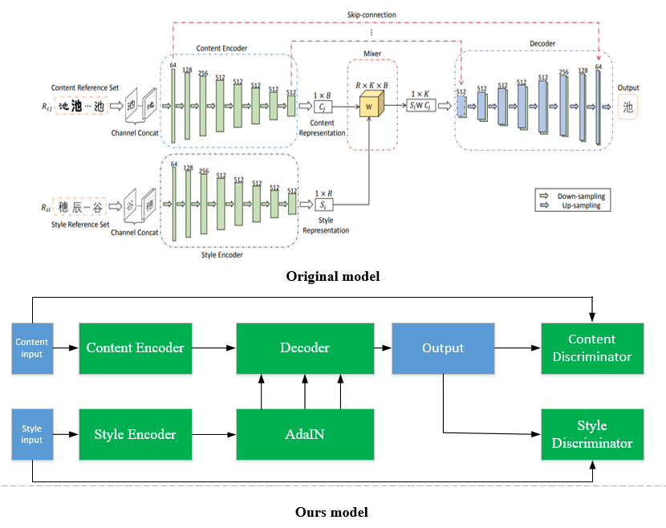

# Enhanced-Fonts-style-transfer
基于EMD的改进汉字字体风格迁移

Networks:
----

Limition:
----
- EMD模型通过一个Style Encoder将原来的字体转换为一个向量表示，本质上是训练一个条件形式的字体风格迁移网络，风格输入仅作为条件生成，
  这样训练出来的模型在遇到训练集中未出现的风格字体时，结果会很差。
- 另一方面，EMD使用固定的三元组字体图像进行训练，一定程度上解决了任意字体图像的风格迁移，由于三元组图像的限制，需要每种字体需要同样
  的字体，由于某种字体的的图像较少产生糟糕的结果。
    
Improvment:
----
- 将Style Encoder 作为真正的风格编码器，将得到的风格连续的输入到Decoder网络模块中，从一定程度上缓解未知风格的字体风格迁移。在特殊
  的情况下，例如：训练集中的图像两两相同的字体十分稀少，能大大改善原始模型的结果。
- 添加GAN损失，分别训练两个判别器，一个判别器用于判断生成的字体是否跟输入的字体为同一个字，一个判别器用来判断生成的字体是否跟输入的
  风格字体为同一种风格字体。同时，由于存在的风格不变特性，将原始的风格信息作为反例进行输入判断。
- 模型可以扩展到无监督的字体风格迁移，将生成的字体再次循环输入到生成器中，做相反的转换进行约束。

Examples:
----

References:
----

- [Separating Style and Content for Generalized Style Transfer](http://openaccess.thecvf.com/content_cvpr_2018/papers/Zhang_Separating_Style_and_CVPR_2018_paper.pdf).
  Yexun Zhang, Ya Zhang, Wenbin Cai.
- [Arbitrary Style Transfer in Real-time with Adaptive Instance Normalization](https://arxiv.org/abs/1703.06868).
  Xun Huang, Serge Belongie.
- [A Style-Based Generator Architecture for Generative Adversarial Networks](https://arxiv.org/abs/1812.04948).
  Tero Karras, Samuli Laine, Timo Aila.
